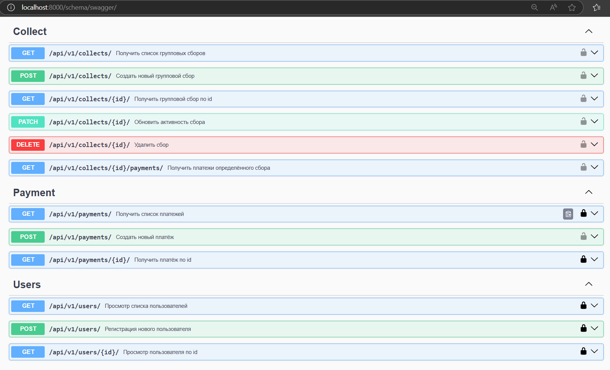

Whip-round - RESTful api-сервис для создания групповых денежных сборов. Зарегистрированные пользователи могут создавать сборы и платежи для своих/чужих сборов
                
Стек: Python3.11.9, Django, DRF, PostgreSQL, Docker-compose, Gunicorn, Nginx, Celery, Celery-beat, django-cacheops, Redis, drf_spectacular.  
                         
## Содержание
- [Локальный запуск проекта](#локальный-запуск-проекта)
- [API проекта](#api-проекта)
- [Заполнение бд моковыми данными](#)
- [Pre-commit](#pre-commit)
                     
___
## Локальный запуск проекта

1. Клонировать репозиторий и перейти в него в командной строке:

```
git clone https://github.com/TatianaSharova/Whip-round.git
```
**_Запуск проекта через docker-compose:_**  

2. На основе .env.example создайте файл .env в корне проекта. Данные в .env.example можно использовать только для локального запуска.
Как получить EMAIL_HOST_PASSWORD можно посмотреть здесь: https://www.geeksforgeeks.org/setup-sending-email-in-django-project/                                          
3. В терминале для запуска выполните команду в корне проекта:

```bash
docker compose up --build  
```

## API проекта
Проект предоставляет REST API для работы с пользователями, групповыми сборами средств и платежами. Анонимные пользователи могут только просматривать данные, зарегистрированные - создавать новые и управлять своими данными (update, delete).

К проекту подключена Swagger-документация, а API задокументирован. Для просмотра документиции после запуска проекта пройдите по ссылке:
```
http://localhost:8000/schema/swagger/
```

Основные endpoint'ы проекта:


# Аутентификация
Аутентификация осуществляется по JWT-токенам. Получение токена и регистрация доступны по соответствующим endpoint'ам. Также для упрощения локального тестирования подключена Basic-аутентификация.

# Особенности
- Каждый сбор имеет дату завершения, при наступлении которой автоматически деактивируется через Celery-задачу.
- Используется кэширование через django-cacheops.

## Заполнение бд моковыми данными
Для заполнения базы данных моковыми данными после запуска проекта в терминале выполните команду:
```bash
docker exec -it whip_backend python manage.py create_mock_data
```
В консоль выведется рузультат загрузки данных.

## Pre-commit
Этот проект использует [`pre-commit`](https://pre-commit.com/) для автоматического запуска линтеров перед коммитом.

# Установка
Установите зависимости для линтинга:

```bash
pip install -r src/requirements/requirements.lint.txt
```

# Настройка pre-commit
Установи хуки:

```bash
pre-commit install
```

Теперь при каждом коммите будут запускаться проверки `flake8` и `isort`.

## Ручной запуск

Проверить все файлы вручную:
```bash
pre-commit run --all-files
```
Проверить конкретные файлы:
```bash
pre-commit run --files path/to/file.py
```

Все настройки линтеров находятся в корне проекта в файле setup.cfg.

### Автор
[Татьяна Шарова](https://github.com/TatianaSharova)